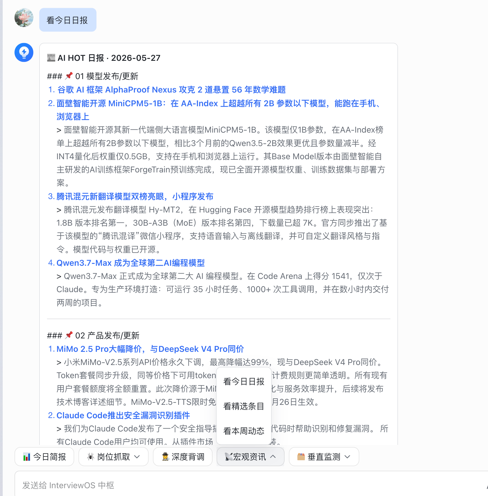
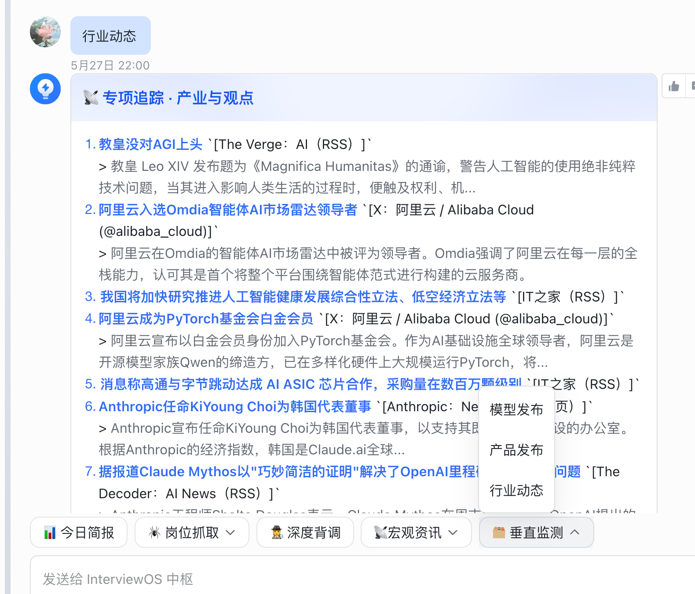

# AI News Radar · Engine A（社区共识引擎）

> 为个人网站 [mengxing-ai.it.com](https://www.mengxing-ai.it.com) 提供 **Engine A** 深度采集能力。
> 与 [my-ai-portfolio](https://github.com/mengxingG/my-ai-portfolio) 的 Next.js 前端、Notion CMS、
> 飞书 ChatOps 网关协同，构成完整的 **AI News Radar** 资讯闭环。

[](https://render.com)
[](https://www.python.org)
[](https://fastapi.tiangolo.com)

## AI News Radar · 每日 AI 资讯

> **双引擎采集 + 三视图阅读 + 飞书触达。** 精选入库由 [ai-news-update](https://github.com/mengxingG/ai-news-update) Engine A（HN / Polymarket / YouTube）经 `fetch-news` 写入 Notion；AI 日报 Tab 仍直连 AI HOT 官方 API；飞书 6 菜单与 Job Engine **共用** `feishu_gateway.py` 门卫（资讯最高优先级，与背调/爬虫隔离）。

### 产品截图
 
 


### 与 my-ai-portfolio 的分工

| 层级 | 仓库 | 职责 |
|------|------|------|
| **采集 + 翻译** | `ai-news-update`（本仓库） | HN / Polymarket / YouTube 三源检索 → DeepSeek/Gemini 中文化 → JSON |
| **入库** | `my-ai-portfolio` | `npm run fetch-news` → `/api/news` → 北京时区今/昨过滤 → URL 去重写 Notion |
| **Web 阅读** | `my-ai-portfolio` | `/ai-news` 三视图：精选 / 全部（Notion）+ AI 日报（AI HOT 官方 API） |
| **飞书触达** | `my-ai-portfolio` + `job_engine` | 6 条菜单暗号 → Python 门卫 → Node `:3001` 卡片引擎 |

> **边界说明**：本仓库只负责 **精选入库** 的社区共识信号。Web「AI 日报」Tab 与飞书 6 菜单仍读 **AI HOT 官方 API**，不经本引擎二次拼装。

线上体验：https://www.mengxing-ai.it.com/ai-news

## 功能概览（与 my-ai-portfolio 对齐）

- **三视图前端**（`/ai-news`）：**精选** / **全部 AI 动态**（Notion CMS，含 Engine A 入库）+ **AI 日报**（AI HOT 最近 30 期归档 + 按日正文）
- **首页预览**（`/#insights` · `AINewsWidget`）：Notion 全量倒序，最多 **20** 条
- **精选入库（本仓库）**：`GET /api/news?topic=AI&days=1` → DeepSeek/Gemini 翻译 → JSON Array
- **飞书菜单卡片**：6 条底部子菜单 → `feishu_gateway.py` → Node `:3001` → AI HOT 数据 → interactive 卡片
- **标星**：Web 端 PATCH `/api/ai-news/star` 写回 Notion（在 my-ai-portfolio 实现）

## 系统架构与数据流转


**四阶段闭环**：

1. **分布式采集**：Engine A（09:30）与 Engine B（10:42）错峰唤醒
2. **清洗与规范化**：JSON Array（`Title`, `Source`, `Author`, `URL`, `OriginalText`, `Date`, `TimeRange`）
3. **入库调度**：`my-ai-portfolio/lib/cron-fetch-news.ts`（或 Make.com）去重写入 Notion
4. **前端渲染**：Next.js 直连 Notion；飞书菜单经 `feishu_gateway.py` 转发 Node 卡片引擎

```
Engine A (本仓库 FastAPI)
  └─ GET /api/news?topic=AI&days=1
        └─ my-ai-portfolio: npm run fetch-news → Notion
              ├─ /ai-news 精选 · 全部
              └─ 首页 AINewsWidget（最多 20 条）

AI HOT 公开 API（日报 / 飞书分类菜单）
  └─ feishu-local-api :3001 ← feishu_gateway.py
        └─ aihot-router + feishu-card-builder → 飞书会话

/ai-news · AI 日报 Tab：/api/ai-news/dailies + /daily/{date}（不经 Notion）
```

### 飞书菜单暗号（须与飞书后台一字不差）

| 菜单文案 | 数据源 |
|----------|--------|
| 看今日日报 | AI HOT `GET /api/public/daily` |
| 看精选条目 | AI HOT `GET /api/public/items?mode=selected` |
| 看本周动态 | AI HOT `GET /api/public/items?mode=selected&since=7d` |
| 模型发布 | AI HOT `category=ai-models` |
| 产品发布 | AI HOT `category=ai-products` |
| 行业动态 | AI HOT `category=industry` |

## 项目来源

基于开源项目 [mvanhorn/last30days-skill](https://github.com/mvanhorn/last30days-skill) 改造：

- **微服务化**：FastAPI 封装 CLI 管线，供 `my-ai-portfolio` / Make.com 定时调用
- **三源精简**：HN / Polymarket / YouTube（X 源由 Coze Engine B 承担）
- **Gemini → DeepSeek**：部分地区 Google API 不稳定，默认 DeepSeek OpenAI 兼容接口
- **优雅降级**：每源 60 秒超时，单源故障不拖死整条管线
- **JSON 输出**：字段与 Notion 资讯库列名一一对应

## 快速开始

### 本地运行 Engine A

```bash
git clone https://github.com/mengxingG/ai-news-update.git
cd ai-news-update

conda create -n ainews python=3.12
conda activate ainews
pip install -e ".[server]"

export DEEPSEEK_API_KEY=sk-xxx
export LLM_PROVIDER=deepseek

python server.py
curl http://127.0.0.1:8000/health
curl "http://127.0.0.1:8000/api/news?topic=AI&days=1"
```

### 与 my-ai-portfolio 联调入库

在 `my-ai-portfolio/.env.local` 中配置：

```bash
NOTION_API_KEY=
NOTION_AI_NEWS_DB_ID=

AI_NEWS_UPDATE_API_URL=http://127.0.0.1:8000
AI_NEWS_UPDATE_TOPIC=AI
AI_NEWS_UPDATE_DAYS=1
AI_NEWS_UPDATE_TIMEOUT_MS=180000
```

```bash
# 终端 1 — Engine A
cd ~/news/ai-news-update && python server.py

# 终端 2 — 入库 Notion
cd ~/my-ai-portfolio && npm run fetch-news

# 终端 3 — 前端预览
npm run dev
# http://localhost:3000/ai-news
```

### Render 部署

```
LLM_PROVIDER=deepseek
DEEPSEEK_API_KEY=sk-xxx
```

生产环境将 `my-ai-portfolio` 的 `AI_NEWS_UPDATE_API_URL` 指向 Render 服务地址。

### Make.com（可选）

- HTTP GET `https://your-service.onrender.com/api/news?topic=AI&days=1`
- Timeout: **180 秒**
- Parse response: ON → 写入 Notion

| API 字段 | Notion 列 |
|----------|-----------|
| Title | Title |
| OriginalText | OriginalText |
| Source | Source |
| URL | URL |
| Date | Date |
| Author | Author（入库时前缀 `Engine A ·`） |

## API 接口

### GET /api/news

**参数**：

- `topic`（必填）：搜索主题，例 `AI`
- `days`（可选）：回溯天数，默认 `1`，范围 1–366

**返回**：

```json
[
  {
    "Title": "DeepSeek 开源新版 R2 模型",
    "Source": "Hacker News",
    "Author": "dang",
    "URL": "https://news.ycombinator.com/item?id=xxx",
    "OriginalText": "DeepSeek 今日开源 R2 模型，在数学与代码基准上…",
    "Date": "2026-04-12",
    "TimeRange": "1d"
  }
]
```

### GET /health

```json
{
  "status": "ok",
  "llm_provider": "deepseek",
  "sources": "hackernews,polymarket,youtube"
}
```

## 致谢

- [KKKKhazix/khazix-skills](https://github.com/KKKKhazix/khazix-skills.git) — 原始项目
- [my-ai-portfolio](https://github.com/mengxingG/my-ai-portfolio) — Web / Notion / 飞书集成
- [Anthropic Claude Code](https://claude.ai/code) · [Cursor](https://cursor.sh)

## License

MIT
