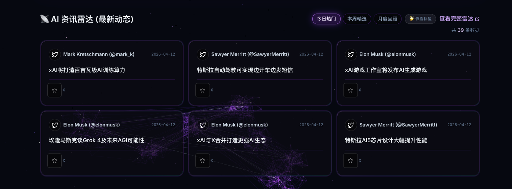
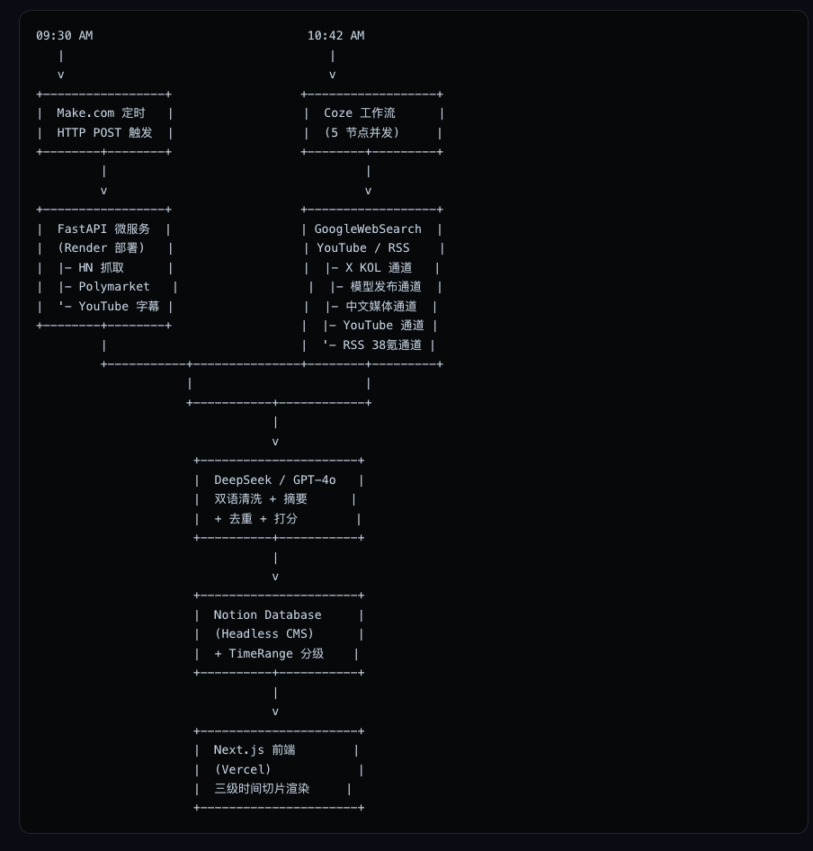

# AI News Radar · FastAPI Engine

> 一个为个人网站 [mengxing-ai.it.com](https://www.mengxing-ai.it.com) 服务的
> AI 资讯深度采集微服务。作为「AI News Radar」双引擎架构中的 **Engine A（社区共识引擎）**，
> 专注于深度挖掘 Hacker News、Polymarket、YouTube 字幕等长尾信号。

[](https://render.com)
[](https://www.python.org)
[](https://fastapi.tiangolo.com)

## 🎯 项目定位

本项目是 AI News Radar 的**代码侧引擎**，与部署在 Coze 平台的无代码引擎协同工作：

| | Engine A（本项目） | Engine B（Coze 工作流） |
|---|---|---|
| 技术栈 | Python + FastAPI + Render | Coze 可视化工作流 |
| 数据源 | HN / Polymarket / YouTube 字幕 | X 博主 / 中文媒体 / RSS |
| 触发时间 | 每天 09:30 AM | 每天 10:42 AM |
| 优势 | 深度、可迭代、稳定 | 灵活、快速、广覆盖 |

两个引擎写入同一个 Notion 数据库，由 Next.js 前端统一渲染。

## 🧬 项目来源

本项目基于开源项目 [mvanhorn/last30days-skill](https://github.com/mvanhorn/last30days-skill)
改造而来。原项目是一个 Claude Skill 设计用于命令行交互，本项目的核心改造包括：

- **微服务化**：用 FastAPI 将 CLI 工具封装为 HTTP 接口，供 Make.com 定时调用
- **三源精简**：从原本的 8 个数据源精简为 HN / Polymarket / YouTube 三源（X 源因台湾
  网络访问限制由 Coze 引擎承担）
- **Gemini → DeepSeek**：因 Google API 在部分地区不可达，切换 LLM 为 DeepSeek（OpenAI 
  兼容接口）
- **优雅降级**：每个数据源独立 60 秒超时，单源故障不拖死整条管线
- **JSON 输出**：返回结构化 `Array<Object>`，字段固定为 
  `Title / Source / Author / URL / OriginalText / Date`

## 📰 项目效果




项目网站：https://www.mengxing-ai.it.com/ai-news

##🏠架构
## ⚙️ 系统架构与数据流转


**数据流转四阶段**：

1. **分布式采集**：异构双引擎在 9:30 与 10:42 错峰唤醒，最大化降低 API 限流概率
2. **清洗与规范化**：格式化为统一的 JSON Array（Title, Source, Author, URL, 
   OriginalText, Date, TimeRange）
3. **中央调度**：Make.com 作为中枢神经，拦截双引擎数据，执行去重逻辑，统一写入 Notion
4. **前端渲染**：Next.js 个人网站直连 Notion API，实现全自动的"抓取-打分-发布"闭环


## 🚀 快速开始

### 本地运行

```bash
# 1. Clone
git clone https://github.com/mengxingG/ai-news-update.git
cd ai-news-update

# 2. 环境
conda create -n ainews python=3.12
conda activate ainews
pip install -e ".[server]"

# 3. 环境变量
export DEEPSEEK_API_KEY=sk-xxx
export LLM_PROVIDER=deepseek

# 4. 启动
python -m uvicorn server:app --host 127.0.0.1 --port 8000

# 5. 测试
curl "http://127.0.0.1:8000/api/news?topic=AI&days=1"
```

### Render 部署

本项目已适配 Render Web Service。环境变量设置：
LLM_PROVIDER=deepseek
DEEPSEEK_API_KEY=sk-xxx

Render 会自动识别 `pyproject.toml` 并构建。

### Make.com 调用

Make.com 端配置：
- HTTP GET `https://your-service.onrender.com/api/news?topic=AI&days=1`
- Timeout: 180 秒（LLM 调用较慢）
- Parse response: ON

## 📡 API 接口

### GET /api/news

**参数**：
- `topic` (必填)：搜索主题，例 `AI`
- `days` (可选)：回溯天数，默认 1，范围 1-366

**返回**：
```json
[
  {
    "Title": "DeepSeek 开源新版 R2 模型",
    "Source": "Hacker News",
    "Author": "dang",
    "URL": "https://news.ycombinator.com/item?id=xxx",
    "OriginalText": "DeepSeek 今日开源 R2 模型，在数学与代码基准上...",
    "Date": "2026-04-12"
  }
]
```

### GET /health

健康检查，返回 `{"status": "ok"}`。


## 🔧 关键设计决策

### 为什么从 Gemini 切换到 DeepSeek？
Google API 代理访问稳定性不佳，gRPC 连接经常超时。DeepSeek 提供
OpenAI 兼容接口 + 原生中文优势 + 极低成本，实测稳定 3 秒内返回。

### 为什么不用 X 官方 API？
xAI Console 新用户注册不再发放 $25 免费额度，且 data-sharing 需要先充值
$5 才能解锁。本项目的 X 数据抓取改由 Coze 引擎通过 GoogleWebSearch 
覆盖。

### 为什么要限制每源 60 秒超时？
原版项目的 subquery 过滤逻辑在 `@dataclass(frozen=True)` 的 SubQuery 上
尝试原地赋值会抛 FrozenInstanceError，且 YouTube 的 yt-dlp 偶尔会卡死 
fork 子进程。60 秒硬超时 + 独立线程执行确保单源故障不阻塞主管线。


## 🤝 致谢

- [mvanhorn/last30days-skill](https://github.com/mvanhorn/last30days-skill) — 原始项目
- [Anthropic Claude Code](https://claude.ai/code) — 协助迁移与调试
- [Cursor](https://cursor.sh) — IDE 与 Agent

## 📜 License

MIT